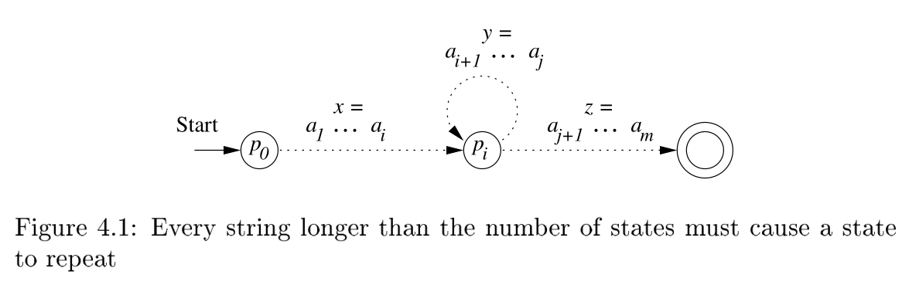

# 使用定理辅助证明器*Lean*形式化泵引理的证明过程

本文源代码：https://github.com/JohnsonLee-debug/Computability

## 背景介绍

本学期的计算理论基础是一门非常有趣的课，课程中涉及了许多定理的证明，讲解了包括自然归纳法，结构归纳法在内的多种证明技术。但是在学习的过程中我感觉到传统的证明存在许多不方便之处，例如我很难对自己写的证明进行检查。而这些证明中涉及到的递归结构是计算机非常擅长处理的结构。于是我想：“能否使用计算机来检查我的证明是否正确，换句话说，能不能用计算机语言把证明输入计算机，然后计算机验证证明？”。事实证明这是可行的，并且目前市面上已经有大量的*Theorem Prover/Proof Assistant/Proof Checker*，例如Coq, Isabelle, Lean等，可以对定理证明起到巨大的帮助。于是本文尝试使用Lean来形式化Pump Lemma的证明过程。

## 计算机辅助证明简介

在正式开始之前我们先介绍一下计算机辅助证明。

### 常见误解与澄清

首先澄清一些对计算机辅助证明的误解。

> 计算机辅助证明就是通过浮点数估算或者穷举法来穷举所有情况证明吗？

不是，计算机辅助证明实质上是让计算机来阅读检查人的证明。另外额外说一下，在证明辅助的语言中，一般不会使用浮点数这种工程数学的概念，反之一般会直接定义和数学里一样的有理数，实数等概念，另外请注意我们**并不需要预留无穷多的内存空间**才能**定义**数目有无穷多的自然数，实数等的**概念**，正如同我们用这有限的大脑，不也思考出了这些东西吗。

> 计算机可以根据命题自动给出证明吗？

大部分情况不行，对于一些线性不等式或者平面几何问题似乎有自动证明。**计算机辅助证明不是自动证明，只是帮助验证人写的证明。所以想要使用计算机辅助证明首先使用者一定至少有证明的思路。**

> 计算机验证证明需要现在流行的人工智能吗？

不需要，这两者基本上是完全独立的两个东西。辅助证明基于各种依赖类型论(*dependent type theory*)，完全只是运行普通的程序。人工智能能否对辅助证明起到帮助我目前还不清楚是否有相关研究。

> 计算机验证可靠吗？会出错/bug吗？

可靠，**至少比人可靠**。计算机辅助证明不是靠深度学习一样通过输入大量数据得到经验解然后来判断证明，而是依照严格的类型论逻辑计算得到的结果。辅助证明总是基于一门计算机语言的(比如本文使用的Lean)，我们会了解到这种验证是基于该语言的类型检查器，而类型检查器是程序语言设计的元理论的部分，**应该是不会轻易出现问题的**。这就如同问用计算器算加法或者用C语言可靠吗一样，当然你完全可以担心用来使用他们的前端软件出现bug，不过这就不是本文要谈论的问题了。

> 辅助证明需要写给计算机的证明和我们传统的数学证明差别大吗？这样写证明难度大吗？会更复杂吗？

有一些差别但不大，这就好比用另一种语言去书写证明，虽然书写的规则不同，但是人思考的方式是共通的。并且计算机语言是一种比起自然语言更准确没有二义性的语言，这其实有利有弊：严格的语言意味着人写证明不能再偷懒了，必须要准确的指出说的是什么，有时候会有些繁琐；好处不言自明，计算机可以验证是否正确，并且学习的人也可以通过查代码看每一步是怎么进行的避免跳步而不理解。某种意义上这种形式化的语言更适合数学，也很有趣。

## 问题引入与定义

现在回到本文的主题上来，既然已知计算机是可以辅助我们进行定理证明，我们如何利用这种技术进行泵引理的形式化呢？首先是选定一种Proof Assistant，本文选取的是Lean，因为Lean社区非常注重本科生教育，社区提供了大量的学习资料，目前已经建立了一个非常大规模的数学定理库mathlib。同时还有由*Imperial College London*主导的*Xena Project*在使用*Lean*编写交互式的数学教材，企图引起数学教育革命。可以说对于本科生而言*Lean*是目前最友好的一个Proof Assistant了。

看到问题本身，首先观察Pump Lemma的内容：

> 如果语言$L$是正则语言，那么存在正整数$N$，对$\forall \in L$，如果$|w| \ge N$，那么可以将$w$分为三部分$w=xyz$满足:
> 
> 1. $y\ne \varepsilon$
> 2. $|xy| \le N$
> 3. $\forall k \ge 0, xy^kz\in L$

那么很明显的我们需要在*Lean*中刻画正则语言及其性质。又联想到上课时泵引理是利用了有穷自动机的有限状态数量和鸽巢原理引入的，所以我们可能需要同时刻画某一种有穷自动机，并且描述有穷自动机与正则语言之间的关系来进行证明。目标与流程很明确了：

1. 定义正则语言并证明一些相关的性质
2. 定义一种有穷自动机并证明其性质，这里选取了DFA
3. 定义泵引理，并证明

## 解决问题

### 定义正则语言

```lean
/- 定义一个universe type -/
universes v
/- 定义一些specific type-/
variables {α β γ : Type*}
/- 一个语言是一个字母表`α`上的串的集合-/
@[derive [has_mem (list α), has_singleton (list α),
    has_insert (list α), complete_boolean_algebra]]
def language (α) := set (list α)
/- derive可以理解为常见编程语言里的implement-/
/- derive some utilities -/
/- derive complete_boolean_algebra则是因为正则语言可以交并补 -/
/- A Boolean algebra is a bounded distributive lattice with a complement
 - operator `c` such that `x ⊓ c(x) = ⊥` and `x ⊔ x = ⊤`.
 - For convenience, it must also provice a set
 - difference operation '\' statisfying `x \ y = x ⊓ c(y)`
 - 布尔代数:https://zh.wikipedia.org/wiki/%E5%B8%83%E5%B0%94%E4%BB%A3%E6%95%B0
 -/
```

如此我们就构造好了一个正则语言的定义，但是仅有这个定义是没什么用的，我们还需要有一些正则语言的性质和运算，这里我将正则语言视作一个semiring并证明了其相关的性质。

```lean
/- instance : `some_type_class` (`specific type`) := `definition` -/
/- `instance`可以理解为对`specific type`使用`definition`实现`some_type_class`-/
/- 加法, 并 -/
instance : has_add (language α) := ⟨(∪)⟩
/- 乘法, 笛卡尔积 -/
instance : has_mul (language α) := ⟨image2 (++)⟩
/- 加法幺元0，空语言 -/
instance : has_zero (language α) := ⟨(∅ : set _)⟩
/- 乘法幺元1，`1: language α` 接受空串的语言 -/
instance : has_one (language α) := ⟨{[]}⟩

/- def 定义一个函数,语法:
 - def 函数名 (参数1: 类型1) ... (类型n: 参数n) : 返回类型 := 函数体-/

/- 定义克林闭包运算,这里没有采用结构归纳定义,使用了字符串拼接来定义 -/
/- 这个定义的意思是：语言`l`的克林闭包里的每一个元素，都可以由`l`里的-/
/- 任意多个串拼接而成-/
/- 例如`l={0,1}`, `0101 ∈ l*`, `0101=[0,1,0,1].join`-/
def star (l : language α) : language α :=
{x| ∃ S: list (list α), x = S.join ∧ ∀ y∈ S, y ∈ l}
/- 对于lemma`:=`的左边是定理定义，右边是对该定理的一个证明 -/
lemma star_def (l: language α) :
  l.star = {x| ∃ S: list (list α), x = S.join ∧ ∀ y∈ S, y ∈ l} := rfl
```

关于幂等,环同态等更多详细的性质可以查阅[实现代码](https://github.com/JohnsonLee-debug/Computability/blob/a8f6eaa77d6b426de64b376a93c0c6bcee2ae672/src/language.lean#L63)

### 定义确定性有穷状态自动机

接下来定义DFA, 这里为了和上面定义的正则语言保持一直，字母表同样使用了**类型**进行描述(在原定义中为集合描述)。

```lean
/- explicit type argument -/
universes u v
/-- 按照DFA的形式化定义其五元组表示, 不过这里没有使用集合论而采用了类型论进行表示
分别为:
输入符号类型`α`
状态类型`σ`
状态转移函数为`tansition`, `σ → α → σ`，可理解为`σ`碰到了`α`转移到新的`σ`
起始状态是`σ`的一个term
接受状态`σ`的集合 --/
structure DFA (α : Type u) (σ : Type v) :=
  (transition : σ → α → σ)
  (start : σ)
  (accept: set σ)
```

接下来定义什么是能被DFA接受的语言，我们需要定义在一个DFA上对一个串`l`进行`evaluate`的操作。
完整实现参考: [DFA.lean](https://github.com/JohnsonLee-debug/Computability/blob/4b45765227c0696335821c4ca539ead5d98d50cf/src/DFA.lean#L20)

```lean
/- `M.eval_from s input` 对从状态`s`开始读入`input`进行求值 -/
def eval_from (start : σ) (input: list α) : σ :=
  list.foldl M.transition start input
```

这里使用到了`list.foldl`这个函数式编程中常见的高阶函数，有些读者可能不熟悉函数式编程，这里给出`foldl`的数学定义：

$$foldl(f,x,z) = \begin{cases}x&z=[]\\foldl(f,f(x,y),z')&z=y::z'\end{cases}$$

有了`eval_from`这一从任意状态开始在DFA上开始evaluate的函数就可以定义从DFA的起始状态开始求值的函数了，只需将`eval_from`的`start`设为状态机的初始状态`M.start`即可。同时我们可以看出DFA对一个串求值的过程会产生一条状态的trace，这将是我们后面发现泵引理的关键。

```lean
def eval : list α → σ := M.eval_from M.start
```

离我们定义什么是能被DFA接收的语言的目标又近了一步，可以知道一个语言若能被DFA接收，即其中所有的串都能被DFA接收，于是就能写出下面的定义

```lean
/- `M.accepts x`能接受`x`，如果对于`x`有`M.eval x ∈ M.accept` -/
def accepts : language α :=
  λ x, M.eval x ∈ M.accept
/- 以及对应的定理 -/
lemma mem_accepts (x : list α) 
    : x ∈ M.accepts ↔ M.eval_from M.start x ∈ M.accept := by refl
```

有了这些基本元素我们就可以正式开始对泵引理进行证明了

### 泵引理引入、定义和证明

首先来回顾一下泵引理的直观定义：



从这个图我们可以将泵引理的证明拆分为两个部分：

1. 利用鸽巢原理，证明当串的长度大于等于自动机的状态数量时，该自动机运行的trace能被拆分为三部分$xyz$并且$y$是一个环，这描述了串的可拆性。
2. 这个环$y$走0次或更多次都会回到$P_i$，即描述了$y$的可泵性。

那我们将这两个子命题进行定义和证明，最后再组合出泵引理即可。

**可拆分性定义与证明**

```lean
/- fintype说明σ是有限的类型(集合)而非无限的类型(集合) -/
/- `M`为DFA，`x`为串，s和t分别为eval的起始状态和终结状态 -/
lemma eval_from_split [fintype σ] {x : list α} {s t : σ}
/- `card`是cardinal的缩写，这里描述了串`x`的长度大于等于σ -/
(hlen : fintype.card σ ≤ x.length)
/- `x`从状态`s`走到`t`-/
(hx : M.eval_from s x = t) :
/- 存在中间状态`q`和`a b c`-/
∃ q a b c,
/- x 能拆分为abc-/
x = a ++ b ++ c ∧
/- |ab| ≤ N,即在算完前`N`个字符之前一定出现了a和b -/
a.length + b.length ≤ fintype.card σ ∧
/- b ≠ ε -/
b ≠ [] ∧
/- a从s走到q -/
M.eval_from s a = q ∧
/- b从q绕回q -/
M.eval_from q b = q ∧
/- c从q走到t -/
M.eval_from q c = t :=
begin
  /- 利用fintype上的鸽巢原理(鸽子和鸽巢都是有限的) -/
  /- 那么有长度n和m, n和m不等,-/
  /- 且`M.eval_from s (x.take n)` = `M.eval_from s (x.take m)`-/
  /- 这里是为了描述a和ab都走到q -/
  obtain ⟨n, m, hneq, heq⟩ := fintype.exists_ne_map_eq_of_card_lt
  (λ n : fin (fintype.card σ + 1), M.eval_from s (x.take n)) (by norm_num),
  /- 不失一般性，我们可以假设n≤m -/
  wlog hle : (n : ℕ) ≤ m using n m,
  /- 又已经知道n和m不等了，所以n<m -/
  have hlt : (n : ℕ) < m := (ne.le_iff_lt hneq).mp hle,
  /- m: (fin |σ| + 1) ≤ |σ|, n < m < |σ| -/
  have hm : (m : ℕ) ≤ fintype.card σ := fin.is_le m,
  dsimp at heq,

  /- 那么q,a,b,c就都找到了, 分别是:-/
  /- q = M.eval_from s (x.take m).take n = M.eval_from s (x.take n)-/
  /- a = x.take m-/
  /- b = (x.take m).drop n-/
  /- c = x.drop m -/
  refine ⟨M.eval_from s ((x.take m).take n),
    (x.take m).take n, (x.take m).drop n, x.drop m,
    _, _, _, by refl, _⟩,

  /- subgoal 1: x = a ++ b ++ c -/
  { rw [list.take_append_drop, list.take_append_drop] },

  /- subgoal 2: |ab| ≤ N -/
  { simp only [list.length_drop, list.length_take],
    rw [min_eq_left (hm.trans hlen), min_eq_left hle, add_tsub_cancel_of_le hle],
    exact hm },

  /- subgoal 3: |b| ≠ 0 -/
  { intro h,
    have hlen' := congr_arg list.length h,
    simp only [list.length_drop, list.length, list.length_take] at hlen',
    rw [min_eq_left, tsub_eq_zero_iff_le] at hlen',
    { apply hneq,
      apply le_antisymm,
      assumption' },
    exact hm.trans hlen, },

  /- b从q绕回q -/
  have hq :
    M.eval_from (M.eval_from s ((x.take m).take n)) ((x.take m).drop n) =
      M.eval_from s ((x.take m).take n),
  { rw [list.take_take, min_eq_left hle, ←eval_from_of_append, heq, ←min_eq_left hle,
        ←list.take_take, min_eq_left hle, list.take_append_drop] },

  use hq,
  rwa [←hq, ←eval_from_of_append, ←eval_from_of_append,
  ←list.append_assoc, list.take_append_drop, list.take_append_drop]
end
```

**可泵性定义与证明**

```lean
/- x绕回来了,多用几个x多绕几圈或者不绕 -/
lemma eval_from_of_pow {x y : list α}
    {s : σ}
    /- x从s走回s -/
    (hx : M.eval_from s x = s)
    /- y是x*里的一个串 -/
    (hy : y ∈ @language.star α {x}) : M.eval_from s y = s :=
begin
  rw language.mem_star at hy,
  rcases hy with ⟨ S, rfl, hS ⟩,
  induction S with a S ih,
  /- y是空串 -/
  { refl },
  /- y = y' ++ x -/
  { have ha := hS a (list.mem_cons_self _ _),
    rw set.mem_singleton_iff at ha,
    rw [list.join, eval_from_of_append, ha, hx],
    apply ih,
    intros z hz,
    exact hS z (list.mem_cons_of_mem a hz) }
  /- 一个简单的induction证明 -/
end
```

**组装出泵引理**

```
/- pump lemma的证明-/
/- 同样先限定σ是个finite type, x是α上的串, hx表明该串能被M接收-/
/- hlen表明x的长度要大于等于|σ|(也就是pump lemma里说的那个`N`)-/
/- 然后用∃对串进行拆分-/
lemma pumping_lemma [fintype σ] {x : list α} (hx : x ∈ M.accepts)
  (hlen : fintype.card σ ≤ list.length x) :
  ∃ a b c, x = a ++ b ++ c ∧ a.length + b.length ≤ fintype.card σ ∧ b ≠ [] ∧
  {a} * language.star {b} * {c} ≤ M.accepts :=
begin
/- 首先利用上面的辅助定理`eval_from_split`进行拆分找到abc并获取相应的结论-/
  obtain ⟨_, a, b, c, hx, hlen, hnil, rfl, hb, hc⟩ := M.eval_from_split hlen rfl,
  use [a, b, c, hx, hlen, hnil],
  intros y hy,
/-拆分hy-/
  rw language.mem_mul at hy,
  rcases hy with ⟨ ab, c', hab, hc', rfl ⟩,
  rw language.mem_mul at hab,
/-再拆hab-/
  rcases hab with ⟨ a', b', ha', hb', rfl ⟩,
  rw set.mem_singleton_iff at ha' hc',
  substs ha' hc',
/- 再利用eval_from_of_pow进行泵进泵出 -/
  have h := M.eval_from_of_pow hb hb',
  rwa [mem_accepts, eval_from_of_append, eval_from_of_append, h, hc]
end
```

## 总结与展望

本文使用Lean建模了DFA和正则语言并对泵引理进行了证明，旨在给予《计算理论基础》这一课程一个教学的新思路。利用交互式定理证明器我们可以更直观的看到定理的证明过程，更加形式化地写下一个定理的证明。由于交互式定理证明器的特点，它消除了我们在纸面书写证明过程时的不确定性，能更好的帮助我们检查自己证明的思路是否正确，以及我们是否真的完成了定理的证明。

或许未来我们可以在这一门课中引入交互式定理证明器的使用，课程涉及到的定理及证明过程可以由教师使用交互式定理证明器进行形式化，学生可以通过对证明代码的逐步阅读与调试完全理解证明的过程，同时因为定理证明器需要证明的每一步都是无二义性的，这消除了我们在理解过程中的歧义，有助于强化严谨的数学思维。同时课后的习题也可以利用交互式定理证明器进行布置，教师将习题定义好，交由学生去进行证明，在批改作业时只需使用程序即可快速检查学生的习题完成情况，对于减轻教学负担也有一定的好处。
